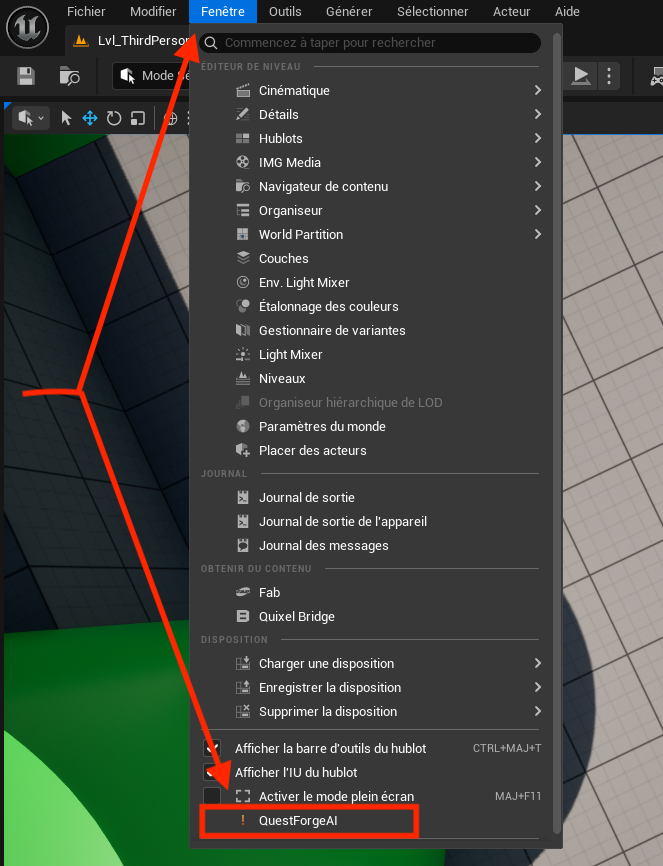
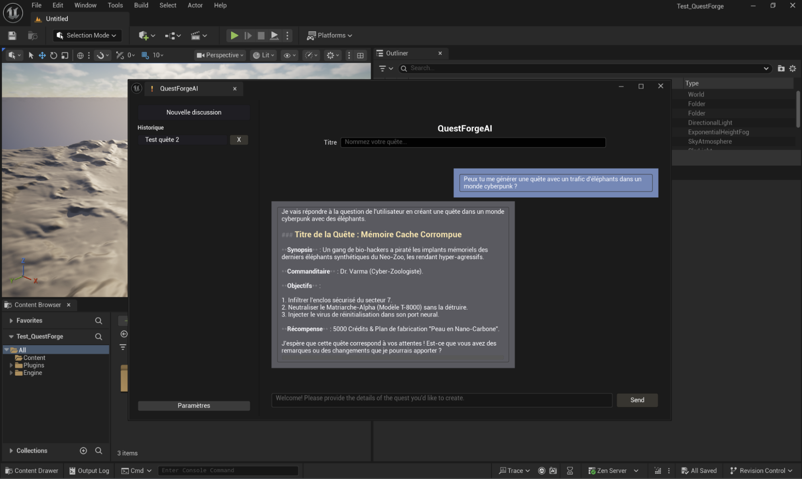
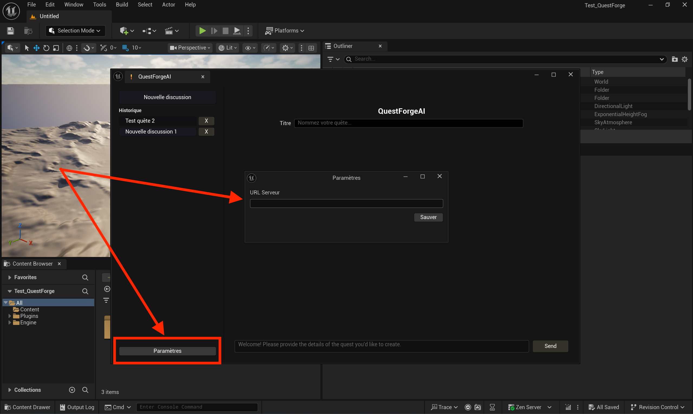
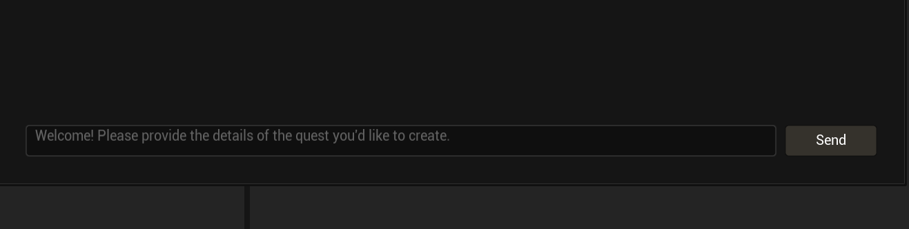
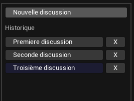

# QuestForgeAI – Documentation (Version Justifiée)

## Sommaire
1. [Présentation du plugin](#présentation-du-plugin)  
2. [Installation du serveur](#installation-du-serveur)  
3. [Installation du plugin](#installation-du-plugin)  
4. [Guide d’utilisation du plugin](#guide-dutilisation-du-plugin)  
5. [Fonctionnement](#fonctionnement)  

---

## Présentation du plugin

<p style="text-align: justify;">

L’objectif du plugin <b>QuestForgeAI</b> est de faciliter le travail des game designers en accélérant leur processus de création et en leur permettant de générer directement des quêtes au sein de l’environnement de développement Unreal Engine.

</p>

<p style="text-align: justify;">

Intégré à Unreal Engine, cet outil offre une interface permettant d’interagir avec un assistant virtuel spécialement optimisé pour la génération de quêtes destinées à des jeux vidéo de type <b>RPG</b> ou <b>Action-Aventure</b>.

</p>

<p style="text-align: justify;">

Ce plugin répond également à un enjeu majeur de l’industrie du jeu vidéo : <b>éviter l’utilisation de grands modèles d’IA publics susceptibles d’exposer des éléments narratifs confidentiels</b>. En conservant le traitement en interne, il limite les risques de fuite d’informations ou de divulgation non contrôlée.

</p>

<p style="text-align: justify;">

Pour cette raison, le modèle d’IA est conçu pour fonctionner <b>on-premise</b>, directement sur l’infrastructure locale du studio, permettant ainsi aux game designers d’accéder en toute sécurité à l’assistant intelligent via le réseau interne.

</p>

---

## Installation du serveur

<p style="text-align: justify;">

Installez d’abord <b>Ollama</b> : https://ollama.com/

</p>

<p style="text-align: justify;">

Téléchargez ensuite les fichiers du serveur : https://github.com/jpontoire/LLM_rag_serveur  
Extrayez l’archive ZIP et placez le dossier où vous le souhaitez.

</p>

<p style="text-align: justify;">

Ouvrez une invite de commande et placez-vous dans le dossier :

</p>

```
LLM_rag_serveur-main
```

<p style="text-align: justify;">

Exécutez le script correspondant à votre système d’exploitation :

</p>

```bash
# Windows
./pull-models_Windows.ps1

# Mac
./pull-models_Mac.sh
```

<p style="text-align: justify;">

<b>NB :</b> Si vous souhaitez éviter d’installer toutes les librairies Python directement sur votre système, modifiez les scripts afin d’y ajouter :  
<code>python -m venv [nom_de_votre_environnement_virtuel]</code>

</p>

<p style="text-align: justify;">

Lancez ensuite le serveur :

</p>

```bash
# Windows
./runRAG.bat

# Mac
./runRAG.sh
```

<p style="text-align: justify;">

Lorsque le message <b>"uvicorn ready"</b> apparaît, le serveur est prêt à recevoir des requêtes.

</p>

---

## Installation du plugin

<p style="text-align: justify;">

Téléchargez le plugin (lien non fourni dans le document original).  
Extrayez l’archive ZIP où vous le souhaitez.

</p>

<p style="text-align: justify;">

Ouvrez une invite de commande, placez-vous dans le dossier du plugin puis exécutez :

</p>

```bash
# Windows
./Install_Plugin_Windows.ps1

# Mac
./Install_Plugin_Mac.sh
```

<p style="text-align: justify;">

Après cela, le plugin sera disponible dans Unreal Engine.

</p>

---

## Guide d’utilisation du plugin

<p style="text-align: justify;">

Pour que l’utilisation du plugin fonctionne correctement, assurez-vous que le <b>serveur IA est démarré</b> et accessible sur le réseau local.

</p>

### Ouverture dans Unreal Engine

<p style="text-align: justify;">

Dans Unreal Engine, cliquez sur <b>Fenêtre</b> (ou <b>Window</b>), puis sur <b>QuestForgeAI</b>. Une fenêtre dédiée s’ouvrira et pourra être déplacée ou dockée comme vous le souhaitez.

</p>

<p align="center">
  
  <br/>
  <em>Bouton pour ouvrir l'interface QuestForgeAI</em>
</p>

</br>

<p align="center">
  
  <br/>
  <em>Interface principale du plugin QuestForgeAI</em>
</p>

### Configuration du serveur

<p style="text-align: justify;">

Renseignez l’adresse du serveur IA suivie de <code>/query</code>.

</p>

<p style="text-align: justify;">

Exemple :  
Adresse réelle : <code>https://mon.adresse.com</code>  
À entrer : <code>https://mon.adresse.com/query</code>

</p>

<p align="center">
  
</p>

### Génération d’une quête

<p style="text-align: justify;">

Dans le champ prévu, entrez la description de la quête ou vos instructions, puis appuyez sur <b>Entrée</b>.

</p>

<p style="text-align: justify;">

Une fois la réponse reçue, vous pouvez poursuivre la conversation comme dans un chat classique.

</p>

<p align="center">
  
</p>

### Gestion des discussions

<p style="text-align: justify;">

- <b>Nouvelle discussion</b> : démarre une nouvelle conversation.  
- <b>Supprimer une discussion</b> : bouton <b>X</b> à côté de celle-ci.

</p>

<p align="center">
  
</p>

---

## Fonctionnement

### Chargement des données

<p style="text-align: justify;">

Au démarrage du serveur, les documents du dossier <b>DATA</b> (ensemble de quêtes provenant de RPG et Action-Aventure) sont chargés.

</p>

<p style="text-align: justify;">

Le contenu est découpé en <b>K chunks</b> de taille fixe (par défaut 20 chunks de 5000 tokens environ).

</p>

<p style="text-align: justify;">

Chaque chunk est transformé en vecteur grâce au modèle d’embedding <b>bge-m3</b>.

</p>

<p style="text-align: justify;">

L’ensemble des vecteurs est ensuite inséré dans un index <b>FAISS</b>, une bibliothèque de recherche vectorielle optimisée développée par Meta.

</p>

### Processus de génération d’une réponse

<p style="text-align: justify;">

1. L’utilisateur envoie une question depuis Unreal Engine.  
2. Unreal envoie une requête HTTP au serveur IA.  
3. Le texte est converti en vecteur via le modèle d’embedding.  
4. FAISS récupère les chunks les plus pertinents.  
5. Ces chunks sont fournis au modèle LLM (par défaut <b>llama3.1:8b</b>).  
6. Le modèle combine la question et les informations retrouvées pour produire une réponse.

</p>
